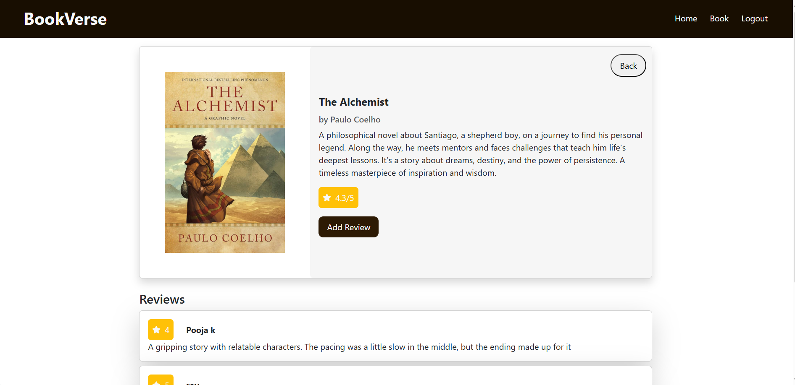
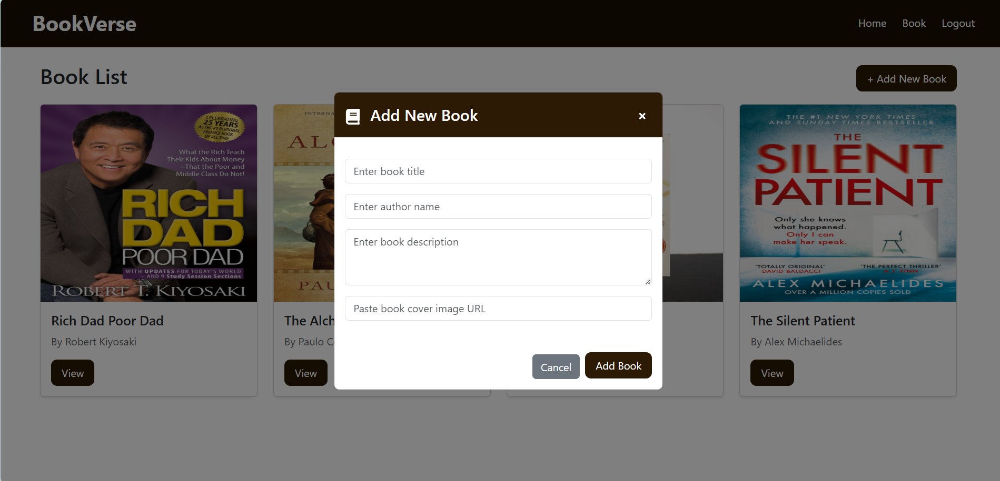

# Book Review Board

A web app for browsing, reviewing, and adding books.

---


## Setup Instructions

1. **Clone the repository**
   ```sh
   git clone https://github.com/Pooja-k22/fontend-book-review.git
   cd fontend-book-review
   ```

2. **Install dependencies**
   ```sh
   npm install
   ```

3. **Start the development server**
   ```sh
   npm run dev
   ```

4. **Open in browser**
   Visit [http://localhost:5173](http://localhost:5173)
   Live link [https://frontend-book-review-board.vercel.app](https://frontend-book-review-board.vercel.app)

---

## API Routes

| Method | Route                       | Description                |
|--------|----------------------------|----------------------------|
| POST   | `/register`                | Register a new user        |
| POST   | `/login`                   | User login                 |
| POST   | `/add-book`                | Add a new book             |
| GET    | `/get-book`                | Get all books              |
| GET    | `/book-detail/:id`         | Get details of a book      |
| POST   | `/add-review`              | Add a review to a book     |
| GET    | `/get-review/:id`          | Get reviews for a book     |

---

## Screenshots








---

## License

MIT
